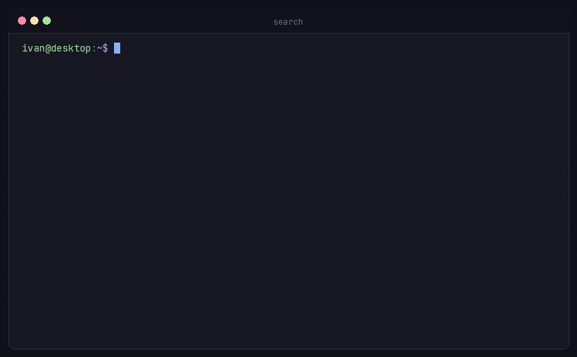

<div align="center">

[English](README.md) | **Русский**

# search-bash

Быстрая консольная утилита поиска и AI-ассистент для Linux и macOS.  
Один файл, ноль внешних зависимостей. Чистый Python 3.10+.

[](LICENSE)
[](https://www.python.org/)
[]()
[](https://t.me/ivanchikbyte)

<br />



</div>

---

## Быстрая установка

Одна команда загружает скрипт в `~/.local/bin/search` и делает его исполняемым:

```bash
curl -fsSL https://raw.githubusercontent.com/ivanchik-byte/search-bash/main/install.sh | bash
```

<details>
<summary>Другие варианты установки (pipx, npm, вручную)</summary>

### pipx (изолированное окружение Python)
```bash
pipx install git+https://github.com/ivanchik-byte/search-bash.git
```

### npm / npx (Node.js)
Установка глобально через npm:
```bash
npm install -g github:ivanchik-byte/search-bash
```
Либо разовый запуск через npx без установки:
```bash
npx github:ivanchik-byte/search-bash "how to configure nginx websocket"
```

### Прямая загрузка
```bash
mkdir -p ~/.local/bin
curl -fsSL https://raw.githubusercontent.com/ivanchik-byte/search-bash/main/search -o ~/.local/bin/search
chmod +x ~/.local/bin/search
```

### Git clone
```bash
git clone https://github.com/ivanchik-byte/search-bash.git ~/.search-bash
mkdir -p ~/.local/bin
ln -sf ~/.search-bash/search ~/.local/bin/search
```

Убедитесь, что `~/.local/bin` добавлен в ваш `$PATH`:
```bash
echo 'export PATH="$HOME/.local/bin:$PATH"' >> ~/.bashrc && source ~/.bashrc
```

</details>

---

## Настройка

При первом запуске выполните интерактивный мастер:

```bash
search --setup
```

Мастер предложит выбрать провайдера и вставить API ключ (ввод скрыт, ключ не попадает в историю bash).

Конфигурация хранится локально в `~/.config/search/config.json` с правами доступа `0600`.

### Поддерживаемые провайдеры

| Провайдер | Модель по умолчанию | Поиск в сети | Для чего подходит |
| :--- | :--- | :--- | :--- |
| **Google Gemini** | `gemini-3.5-flash-lite` | Да (Google Search Grounding) | Быстрые ответы, свежая документация, бесплатный тариф |
| **Nvidia NIM** | `nvidia/nemotron-3.5-lightning-30b-a3b` | Нет | Сложный анализ кода и быстрый инференс |
| **OpenRouter** | `meta-llama/llama-3.3-70b-instruct` | Опционально | Доступ к 200+ моделям (Claude, Llama, DeepSeek) |
| **Свой / Локальный** | Указывается пользователем | Нет | Локальная Ollama, Groq, vLLM, свои эндпоинты |

---

## Основные возможности

### 1. Поиск в сети прямо из терминала

Задавайте технические вопросы прямо в командной строке. При использовании Gemini ответы подтверждаются реальными результатами поиска Google:

```bash
search "как настроить reverse proxy в nginx для websocket"
```

### 2. Генерация и запуск консольных команд

Флаг `-c` помогает вспомнить синтаксис нужной команды. Утилита выводит готовую команду и предлагает сразу её выполнить:

```bash
search -c "найти файлы больше 500MB измененные за последние 7 дней"
```

```text
find . -type f -size +500M -mtime -7 -exec ls -lh {} +

Execute command? [y/N]:
```

### 3. Анализ каталогов и очистка места на диске

Флаг `-a` (или `-d <путь>`) анализирует структуру папки, группирует файлы, находит тяжелые файлы, сворачивает мусорные папки (`node_modules`, `.git`) и подсказывает, что можно безопасно удалить:

```bash
search -a
```

После вывода дерева можно сразу проинспектировать файлы кандидаты по номеру или пути:

```text
Inspect file content? [1-10 or file path, Enter to finish]: 1
... [AI анализирует назначение файла и безопасность удаления] ...
Delete 'dump_2026.sql'? [y/N]: y
```

### 4. Анализ логов через конвейер (pipe)

Передавайте вывод команд или файлы журналов напрямую в `search` для диагностики ошибок:

```bash
cat /var/log/nginx/error.log | search "объясни причину разрыва соединения"
```

### 5. Передача файлов и логов в контекст

Используйте флаг `-f` для передачи файлов или масок. Для больших логов утилита автоматически считывает свежие хвосты:

```bash
search -f "*.log" "найди главные ошибки за последние сутки"
```

---

## Таблица параметров

| Параметр | Описание |
| :--- | :--- |
| `-c, --cmd` | Сгенерировать команду оболочки с запросом на выполнение |
| `-a, --all-files` | Просканировать текущий каталог и выделить кандидатов на удаление |
| `-d, --dir PATH` | Просканировать указанный каталог |
| `-f, --file PATH` | Передать файл или маску (`-f "*.log"`, `-f file.txt:tail:100`) |
| `-p, --provider NAME` | Переопределить провайдера (`gemini`, `nvidia`, `openrouter`, `custom`) |
| `-m, --model NAME` | Переопределить модель для одного запроса |
| `-s, --site DOMAIN` | Ограничить поиск конкретным доменом (например `docs.docker.com`) |
| `-i, --interactive` | Запустить интерактивный режим |
| `-w, --no-web` | Отключить поиск в сети |
| `-r, --raw` | Вывод простым текстом без рамок и разметки |
| `-y, --yes` | Выполнить команду без запроса подтверждения |
| `--setup` | Запустить мастер настройки провайдера и ключа |
| `--clear-cache` | Очистить локальный кэш ответов в `~/.cache/search_cli/` |

---

## Зачем я это написал

Я написал search-bash, потому что мне нужно было включить ПК и зайти на виртуалку. Но перед этим нужно было кое-что посмотреть в браузере. Так как я пользуюсь Firefox, мне просто не хотелось открывать браузер, ждать восстановления всех вкладок, открывать новую вкладку, гуглить что нужно, закрывать её, убивать процесс через pkill (чтобы старые вкладки не стёрлись и не пришлось потом жать Ctrl+Shift+T), и только потом подключаться к виртуалке. Поэтому я сделал эту простую и удобную CLI-утилитку.

---

## Сообщество и безопасность

- **Разработка**: Правила участия описаны в [CONTRIBUTING.md](CONTRIBUTING.md).
- **Кодекс поведения**: См. [CODE_OF_CONDUCT.md](CODE_OF_CONDUCT.md).
- **Безопасность**: Для закрытых сообщений об уязвимостях см. [SECURITY.md](SECURITY.md).

---

## Лицензия

MIT
